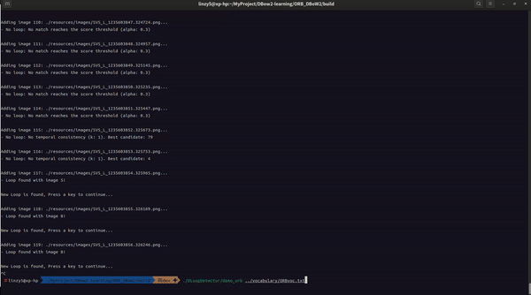

# DBoW2/DLoopDetector

## 介绍

这个项目主要是在[DLoopDetector]的基础上，根据[ORB_SLAM]中的改进，将词典（vocabulary）的载入部分更改为直接从`txt`文件读取，而不是从`yaml`文件中读取。
[DBoW2]的原始实现——从`yaml`中读取字典，非常耗时，读取[DLoopDetector]读了好几个小时都没读完。改为从`txt`中读取后，读取时间缩短到了几秒钟。

改进点：

- 从`txt`中读取字典
- 修复了[DLoopDetector]中的一些bug
- 将[DBoW2],[DLib],[DLoopDetector]整合到一个工程中，避免依赖问题和编译问题
- 整个项目只需要依赖`OpenCV`
- 在[DLoopDetector]提供的`demo_brief.cpp`基础上，增加了`demo_orb.cpp`，并提供字典可以直接运行检验结果

## 字典解压

```shell
cd vocabulary
unzip ORBvoc.zip
cd ..
```

## 编译

```shell
mkdir build
cd build
cmake ..
make
```

## 运行

```shell
cd build
./DLoopDetector/demo_orb ../vocabulary/ORBvoc.txt
```



[DLoopDetector]:https://github.com/dorian3d/DLoopDetector
[ORB_SLAM]:https://github.com/UZ-SLAMLab/ORB_SLAM3
[DBoW2]:https://github.com/dorian3d/DBoW2
[DLib]:https://github.com/dorian3d/DLib